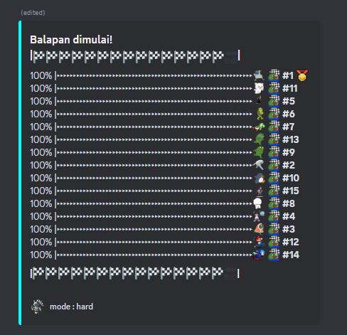

╔═══════════════════════════════════════════════════╗
║ 🔥 DEVELOPER STATUS: ONLINE ║
║ 💻 CURRENT PROJECT: EzCoRp Official and 20+ bot more ║
║ 🎮 SPECIALTY: Discord Bot Development ║
║ 🌐 LOCATION: ..... ║
╚═══════════════════════════════════════════════════╝

---

## ⚡ TECH ARSENAL

### 🔥 Primary Weapons  
`JavaScript` · `Python` · `TypeScript` · `React`

### 🛡️ Secondary Arsenal  
`PHP` · `Laravel` · `Vue.js` · `Django`

### ⚔️ Additional Tools  
`Java` · `C++` · `Ruby` · `Node.js`

---

## 🏆 Little Example

### 👑 EZCORP OFFICIAL BOT  
_The Ultimate Discord Experience_

Project: EZCorp Official Bot
Status: ✅ ACTIVE & DEPLOYED
Features:
  🎁 Advanced Giveaway System:
    - Flash Giveaways
    - Split & Steal Mechanics
    - Random Distribution
    - Bomb Giveaways
  
  🎮 Interactive Mini Games:
    - Qiuqiu Multiplayer
    - Blackjack Tournament
    - Gaplek Championship
    - Snake & Ladder Arena
    - Quiz Competition
    - Number Hunt
    - Hunger Games Simulation
    - Word Chain Challenge
    - Mind Reader (Solo)

  🤖 AI Integration:
    - ChatGPT 4.0 Support
    - LLaMA 3.1 405b
    - Gemini AI
    - DALL·E 3 Image Generation

  🛡️ Moderation Suite:
    - Advanced Kick/Ban System
    - Auto-Moderation
    - Custom Commands

    
🏁 ARACE RACING BOT
High-Speed Racing Simulation

  

yaml
Salin
Edit
Project: Arace Racing Bot
Status: ✅ LIVE & RACING
Features:
  🐎 Animal Racing System
  💰 Betting Mechanics
  🏆 Tournament Mode
  📊 Statistics Tracking
  🎯 Real-time Racing Animation
📊 SYSTEM ANALYTICS

    

🌐 NETWORK CONNECTIONS
🎮 Join the Matrix (Discord Server): discord.gg/ezcorp

🤖 Invite Arace Bot: Coming Soon

🌐 Website: khaivanhouten.my.id
Free macros and stay voice 24/7

📡 Discord Handle: khaivanhoutenn#0000

📬 Email Gateway: khairilrudi1213@gmail.com

💀 DEVELOPER MANIFESTO

.developer {
  name: "Khai Van Houten";
  specialty: "Discord Bot Development";
  motto: "In code we trust, in bugs we debug";
  fuel: "☕ Unlimited Coffee";
  mode: "Dark Mode";
}

🏆 ACHIEVEMENT UNLOCKED
🏆 Achievement	📊 Progress	🎯 Status
Discord Bots Created	2+	✅ COMPLETE
Active Users Served	1000+	🔥 GROWING
Lines of Code Written	50K+	📈 INCREASING
Coffee Consumed	∞	☕ UNLIMITED

🔮 FUTURE PROTOCOLS

Roadmap_2024:
  Q4:
    - 🚀 EZCorp Bot v3.0 Release
    - 🎮 New Mini-Game Integration
    - 🤖 Advanced AI Features
    - 🌐 Web Dashboard Launch

  Upcoming_Features:
    - 💎 NFT Integration
    - 🎵 Music Bot Module
    - 📊 Advanced Analytics
    - 🔐 Enhanced Security

 
💫 "In code we trust, in bugs we debug" 💫
Made with ❤️ — Powered by ☕ Coffee

